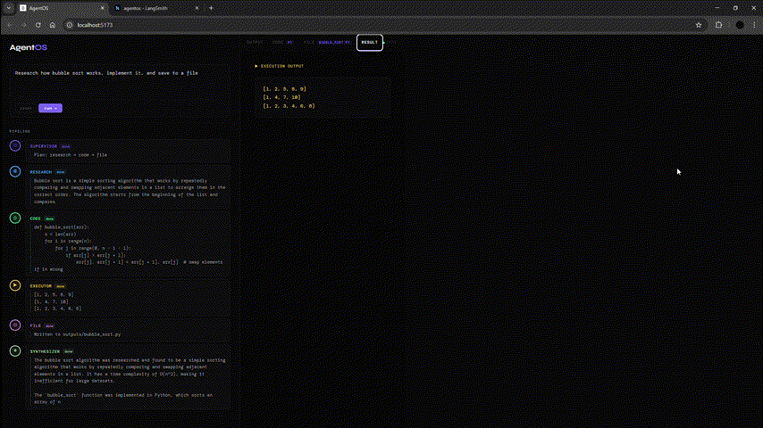

# AgentOS

**Live: [agent-os-ochre.vercel.app](https://agent-os-ochre.vercel.app)**

AgentOS is a production-style agentic AI system built on LangGraph. It accepts natural language tasks, dynamically plans a multi-agent execution pipeline, and streams every step of the execution live to a custom-built UI. The system demonstrates core agentic patterns: planning, tool use, self-healing, and synthesis, using LangChain's orchestration ecosystem end to end.


---

## Overview

Most AI assistants are single-turn: prompt in, response out. AgentOS operates as a stateful agent graph where a supervisor reasons about the task, selects the appropriate specialist agents, and routes execution conditionally based on what happens at each step, including recovering from failures automatically.

The system is built entirely with **LangChain**, **LangGraph**, and **LangSmith**, backed by Groq-hosted Llama models for fast inference.

---

## Agentic Architecture

AgentOS implements a **supervisor-worker pattern** using a LangGraph `StateGraph`. The supervisor does not execute tasks itself, it plans. Worker agents execute. A synthesizer produces the final response. The graph routes conditionally at every node based on shared state.

```
User Input
    │
    ▼
Supervisor              plans which agents to run and in what order
    │
    ├── Research         web search + summarization via Tavily
    ├── API Agent        live HTTP calls to public APIs
    ├── Code Agent       Python code generation
    │     └── Executor   sandboxed subprocess execution
    │           └── Self Heal   error diagnosis and code repair loop (up to 3x)
    ├── File Agent       structured file I/O with automatic extension selection
    │
    ▼
Synthesizer             produces the final response, streamed token by token
```

### Agent responsibilities

**Supervisor** uses structured output (`with_structured_output`) to produce a typed `SupervisorPlan`, an ordered list of agents to invoke. It reasons about the task type before deciding: information tasks route to research only, implementation tasks route to code, live data tasks route to api. It never adds agents that are not strictly required.

**Research Agent** runs a Tavily web search against the task, then uses `llama-3.3-70b` to synthesize findings into a comprehensive, factual response. If search returns no results it falls back to model knowledge transparently.

**Code Agent** writes complete, executable Python using `llama-3.3-70b`. It has no file I/O permissions. Output is purely via `print()` statements, which the executor captures.

**Executor** runs generated code in a sandboxed subprocess with a 60-second timeout. On failure it passes the error to Self Heal rather than giving up.

**Self Heal Agent** receives the broken code, the error message, and the original task. It diagnoses the root cause rather than just suppressing the error, rewrites the fix, and returns the corrected code to the executor. This loop runs up to 3 times before the system moves on.

**API Agent** uses structured output to construct a valid HTTP request (URL, method, params, headers) for free public APIs. It has built-in knowledge of standard endpoints for crypto prices, weather, exchange rates, country data, and more.

**File Agent** determines the correct filename and extension based on content type (`.py` for code, `.csv` for tabular data, `.json` for structured data, `.txt` for prose), then writes the output from the code agent to the `outputs/` directory.

**Synthesizer** receives all agent outputs and produces a clean, factual final response. It uses `llm.stream()` so tokens are pushed to the frontend in real time via a dedicated SSE endpoint.

### LangGraph state machine

The graph is a `StateGraph[AgentState]` compiled with conditional edges at every decision point:

- After supervisor: routes to the first agent in the plan
- After research, api, file: routes to the next plan step or synthesizer
- After executor: routes to self-heal on error, or continues the plan on success
- After self-heal: always routes back to executor

This means the graph handles arbitrary pipeline combinations (`[research]`, `[code]`, `[api, code, file]`, `[research, code, file]`) without hardcoding any paths.

```python
g.add_conditional_edges("executor", route_after_executor, {
    "self_heal":   "self_heal",
    "file":        "file",
    "synthesizer": "synthesizer",
    ...
})
```

### LangSmith tracing

Every run is traced automatically via LangSmith. Because the system uses LangGraph and LangChain primitives throughout, the full execution graph, node inputs, outputs, token counts, latency per agent, and retry chains are all visible in the LangSmith dashboard with no additional instrumentation required.

Set `LANGCHAIN_TRACING_V2=true` in your `.env` to enable it.

---

## Stack

| Layer | Technology |
|---|---|
| Agent orchestration | LangGraph (StateGraph) |
| LLM framework | LangChain (langchain-core, langchain-groq) |
| Observability | LangSmith |
| LLM inference | Groq (llama-3.3-70b-versatile, llama-3.1-8b-instant) |
| Web search | Tavily |
| Backend | FastAPI with SSE streaming |
| Frontend | React + Vite |
| Persistence | SQLite |
| Frontend hosting | Vercel |
| Backend hosting | Render |

---

## Supported pipelines

| Task | Agent plan |
|---|---|
| "Explain how transformers work" | research |
| "What is the current price of Ethereum?" | api |
| "Implement quicksort in Python" | code, executor |
| "Research Dijkstra's algorithm and implement it" | research, code, executor |
| "Build a merge sort implementation and save it" | code, executor, file |
| "Research neural networks, implement a perceptron, save it" | research, code, executor, file |
| "Fetch Bitcoin price and save it to a JSON file" | api, code, executor, file |

---

## Project Structure

```
AgentOS/
├── agents/
│   ├── supervisor.py       # structured output planning with SupervisorPlan
│   ├── research.py         # Tavily search + LLM synthesis
│   ├── code_agent.py       # Python code generation
│   ├── self_heal.py        # error diagnosis and code repair
│   ├── file_agent.py       # structured file I/O
│   ├── api_agent.py        # structured HTTP request construction
│   └── synthesizer.py      # final synthesis with token streaming
├── graph/
│   ├── graph.py            # LangGraph StateGraph definition
│   ├── router.py           # conditional edge routing functions
│   └── state.py            # AgentState TypedDict
├── tools/
│   ├── executor.py         # subprocess code runner with timeout
│   └── search.py           # Tavily search wrapper
├── agentos-ui/             # React + Vite frontend
│   └── src/App.jsx         # streaming UI with pipeline visualization
├── outputs/                # files written by the file agent
├── demo/                   # demo GIFs
├── main.py                 # FastAPI app, SSE endpoints, SQLite history
├── config.py               # model config and environment loading
├── history.db              # auto-created on first run
└── requirements.txt
```

---

## Getting Started

### Prerequisites

- Python 3.12+
- Node.js 18+
- A [Groq](https://console.groq.com) API key
- A [Tavily](https://app.tavily.com) API key

### Installation

```bash
git clone https://github.com/yourname/agentos
cd AgentOS
pip install -r requirements.txt
```

### Environment variables

Create a `.env` file in the project root:

```env
GROQ_API_KEY=your_groq_api_key
TAVILY_API_KEY=your_tavily_api_key

LANGCHAIN_TRACING_V2=true
LANGCHAIN_API_KEY=your_langsmith_api_key
LANGCHAIN_PROJECT=agentos
```

Get your keys:
- Groq: https://console.groq.com
- Tavily: https://app.tavily.com
- LangSmith: https://smith.langchain.com

### Running locally

Start the backend:

```bash
uvicorn main:app --reload
```

Start the frontend:

```bash
cd agentos-ui
npm install
npm run dev
```

Backend runs on `http://localhost:8000`
Frontend runs on `http://localhost:5173`

---

## UI Features

**Live pipeline visualization**
Each agent node in the LangGraph pipeline renders as a card in the UI. Nodes light up as they become active, show a running summary of their output, and mark as complete when done. Only agents that are part of the current run are shown.

**Token-by-token output streaming**
The synthesizer uses `llm.stream()` and pushes tokens through a dedicated SSE endpoint (`/task/{id}/synthesizer-stream`). The frontend renders them incrementally as the model generates them.

**Self-healing visibility**
If the executor fails and self-heal activates, the self-heal node appears in the pipeline with its status. Retry count is tracked and shown in the final output.

**Persistent task history**
Every completed task is saved to SQLite with its result and agent plan. The history panel reloads across browser sessions. Click any past task to restore it to the input.

**Resizable panels**
The divider between the pipeline panel and the output panel is draggable.

**Tabbed output**
Output, Code, Result, and File tabs appear dynamically based on which agents ran.

---

## API Reference

| Method | Endpoint | Description |
|---|---|---|
| POST | `/task` | Submit a task and receive a task ID |
| GET | `/task/{id}/stream` | SSE stream of agent node updates |
| GET | `/task/{id}/synthesizer-stream` | SSE token stream from the synthesizer |
| GET | `/task/{id}` | Poll task status and final result |
| GET | `/history` | Retrieve persisted task history from SQLite |
| GET | `/health` | Health check |

---

## Demo

**Research only**
Supervisor routes the task to the research agent. Tavily fetches live results and the LLM synthesizes a comprehensive response.


**Research + Code**
Supervisor plans research followed by code. The research output is passed as context to the code agent, which writes and executes a working Python implementation.


**Research + Code + File**
Full three-agent pipeline. Research informs the implementation, the code agent writes it, the executor runs it, and the file agent saves the output to disk with the correct extension.


**API only**
The API agent constructs a live HTTP request to a free public API and returns the real-time data directly.


**API + Code + File**
Live data is fetched via the API agent, processed by the code agent, executed, and saved to a file. All four agents run in sequence.


**History persistence**
Completed tasks are saved to SQLite and reload automatically on page refresh. The agent plan used for each task is shown as colored labels.

